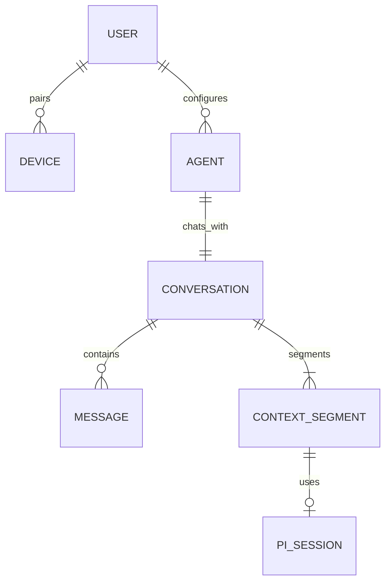

# AgentChat 架构总览

> **Status**: `active`（已确定的架构决策；不表示目标功能已经实现）。

## 系统目标与约束

AgentChat 为个人重度 AI 用户提供按角色组织的 Agent 协作入口；首发由 macOS 桌面 Host 运行 Pi Coding Agent，并向同一局域网内的 iOS、Android 客户端提供会话访问。产品定位与用户场景见[产品蓝图](../PRODUCT_BLUEPRINT.md)。

核心约束：

- AgentChat Host 只在用户的 macOS 设备上执行 Pi；显式退出 Host 时本地执行停止，设备睡眠时本地执行暂停。
- 桌面窗口关闭后，Tauri 应用进程留在菜单栏后台；显式退出应用时，Pi RPC 子进程停止。
- 首发只提供局域网连接，不提供公网中继、VPN 接入或 PWA。
- AgentChat 持久化用户消息、最终 Agent 结果与各 Agent 的独立记忆；Pi 持久化自己的会话执行细节。
- Pi 工具在 macOS 用户权限下执行。Agent 配置的工作目录是默认上下文，不是强制安全隔离边界。
- 首发每个 Agent 只有一条长期 Conversation；`clear` 只开启新的 Pi 上下文，聊天消息历史保留。同一 Conversation 中的消息按序处理，Host 初始最多同时运行两个 Pi 执行。
- 首发不提供附件、独立 Task 实体、Run 状态持久化、应用层数据加密、备份或导出。

## 架构文档导航

- [Host Runtime](01-host-runtime.md)：会话、消息、SQLite、本地队列与桌面 Host 生命周期。
- [Pi Runtime Adapter](02-pi-runtime.md)：Pi CLI RPC、Pi Session 映射、进程管理与工具权限边界。
- [Device Access](03-device-access.md)：Tauri 客户端、局域网配对、TLS 信任、mDNS 与消息同步。
- [数据存储](04-data-storage.md)：产品数据、Agent 记忆、Pi Session、设备凭据与手机缓存的归属和生命周期。

### 参考文档

- [目标目录结构](99-directory-structure.md)

## 核心设计原则

1. **Host 是产品事实来源：** Host 保存 AgentChat 的角色配置、会话消息、最终结果与各 Agent 记忆；客户端离线缓存只用于只读展示，不覆盖 Host 数据。
2. **Pi 执行与产品状态分离：** Pi 负责 Coding Agent 执行与会话持久化；Host 负责产品消息、设备访问和客户端同步，避免重复保存 Pi 的工具明细。
3. **本地优先、网络最小化：** Host 仅为配对设备提供局域网 API，不建立公网入口或中继，减少远程信任边界。
4. **先约束复杂度：** 首发采用单 Agent 对话、有限并发和消息级持久化，不引入多 Agent 编排、持久化任务系统或附件存储。

## 关键设计决策

| 决策问题                             | 选择                                                                     | 放弃的替代方案                                                          | 理由                                                                                     | 变更条件                                             |
| ------------------------------------ | ------------------------------------------------------------------------ | ----------------------------------------------------------------------- | ---------------------------------------------------------------------------------------- | ---------------------------------------------------- |
| 桌面 Host 和手机客户端采用什么宿主？ | 桌面与 iOS/Android 客户端采用 Tauri；Host 运行在桌面 Tauri Rust 进程中。 | Electron 桌面端、React Native 客户端、独立常驻服务。                    | 复用 React UI，并让桌面与手机共享 Tauri 宿主体系；首发不需要独立部署 Host。              | Tauri 移动端能力或 Rust 集成无法满足目标平台要求时。 |
| 如何接入 Coding Agent？              | 使用用户预装的 Pi CLI RPC；复用 Pi 的现有模型与认证配置。                | 将 Pi SDK 嵌入应用、由 AgentChat 分发 Pi CLI、从零实现 Agent Loop。     | RPC 适合 Rust Host 的进程边界，并保留 Pi 自己的会话管理。                                | Pi RPC 无法满足已验证的流式交互或会话恢复需求时。    |
| 首发的网络拓扑是什么？               | 仅局域网；HTTPS 请求与 SSE 事件；首次二维码配对，后续 mDNS 发现。        | 公网中继、远程隧道、WebSocket 全双工、PWA 直连。                        | 首发不承担云服务和公网威胁面；客户端到 Host 的操作请求与 Host 到客户端的事件流职责不同。 | 用户研究确认外网访问是首发必要能力时。               |
| AgentChat 与 Pi 分别持久化什么？     | Host 用 SQLite 保存产品消息和最终结果、用独立 Markdown 文件保存各 Agent 记忆；Pi 保存执行会话与工具细节。 | Host 复制完整 Pi 事件流、仅依赖 Pi 历史展示、持久化完整 Run/Task 状态。 | 保留多端可读的产品历史和独立分身记忆，同时避免重复保存执行轨迹和恢复状态机。 | 需要精确恢复任务状态、审计工具行为或跨设备回放时。 |
| 如何授予 Pi 工具权限？               | Pi 以当前 macOS 用户权限自动执行；Agent 工作目录只设置默认上下文。       | 首发实现 OS 沙箱、每次工具审批或强制工作区隔离。                        | 用户接受 Pi CLI 的本机权限模型；首发不承诺 Pi 被限制在工作目录内。                       | 产品安全承诺要求工具不能访问用户工作区之外的资源时。 |

## 边界划分

```text
Desktop Tauri UI ── Tauri Command ─────────────┐
                                                ▼
Mobile Tauri UI ── HTTPS / SSE ──> Device Access ──> Host Runtime
                                                       │       │
                                                       │       └──> Pi Runtime Adapter ──> Pi CLI RPC
                                                       │                                 └── Pi Session
                                                       └──────────> SQLite（产品数据）
                                                       └──────────> Agent 记忆文件
```

- [Host Runtime](01-host-runtime.md) 负责 AgentChat 产品数据、消息顺序和本地应用生命周期，不负责 Agent 推理。
- Desktop UI 通过 Tauri Command 调用同进程 Host；移动客户端通过 HTTPS 请求与 SSE 事件连接 Host。
- [Pi Runtime Adapter](02-pi-runtime.md) 负责 Pi CLI RPC 和 Pi Session，不负责 AgentChat 消息数据库。
- [Device Access](03-device-access.md) 负责配对设备的局域网连接与客户端同步，不负责 Pi 工具执行。
- 认证、错误映射和日志属于跨切关注点，不单独构成业务模块：Device Access 验证客户端身份；Host Runtime 定义业务错误语义；Pi Runtime Adapter 将进程/协议错误转换为 Host 可识别的运行错误。运行日志不包含模型密钥或设备凭据。

模块依赖保持单向：移动客户端调用 Device Access；桌面 UI 通过 Tauri Command 调用 Host Runtime；Device Access 调用 Host Runtime；Host Runtime 调用 Pi Runtime Adapter；Pi Runtime Adapter 不调用客户端或 Host 内部存储。

## 核心实体关系

- **User：** 单个本机 AgentChat 安装的所有者；首发仅保存安装标识，不建立多用户账号表。
- **Device：** 经二维码配对并可单独撤销的客户端设备。
- **Agent：** 用户选择的角色配置，包含 Pi 工作上下文和产品身份。
- **Agent 记忆：** 按 Agent 独立保存的 Markdown 文件，由 Host 管理和提供给对应 Pi 进程。
- **Conversation：** 首发与一个 Agent 一对一关联的长期 IM 聊天；消息历史不因 `clear` 消失。
- **Context Segment：** Conversation 中一次连续使用的 Pi 上下文；每次 `clear` 开启新段，一个段至多关联一个 Pi Session。
- **Message：** 用户输入或 Agent 最终响应；Host 持久化消息内容与结果。
- **Pi Session：** Pi 拥有并持久化的执行上下文；Host 为当前 Context Segment 选择对应 Session，但不复制其工具调用明细。

群聊的目标扩展仍使用 Conversation 作为共享消息时间线，并给每个参与 Agent 保留独立 Context Segment 与 Pi Session。只有被 `@` 的 Agent 执行，`@all` 指向群内所有活跃 Agent；没有 `@` 的消息只进入共享时间线。Agent 下次被唤起时补读本轮群上下文中尚未看到的人类及其他 Agent 消息。群聊 `clear` 一次重置所有 Agent 的上下文，且必须等待整条群聊的执行队列空闲。目标表和迁移见[数据存储的群聊扩展](04-data-storage.md#群聊扩展v2-目标设计)；首发仍按下图实现单聊。



Run 是 Host 运行期间的临时执行状态，不作为首发持久化实体；Task 不作为首发实体。

## 整体流程

### 发送消息并接收结果

```text
手机或桌面客户端
  → Host 接收并持久化用户消息
  → Host 将消息排入对应 Conversation 的 Pi 执行队列
  → Pi RPC 流式产生内容；Host 将 delta 实时推送给在线客户端
  → Host 持久化最终响应；客户端后续从 Host 读取消息结果
```

### 清理当前上下文

聊天空闲时，用户对同一 Conversation 执行 `clear`。Host 保留全部消息和旧 Pi Session 引用，结束当前 Context Segment 并开启新段；下一条消息使用新 Pi Session。运行中或有消息排队时，用户须等待或先取消相关执行。

### 首次设备配对

1. 桌面 Host 展示一次性配对二维码，其中包含局域网连接信息、Host 证书指纹和短时配对凭据。
2. Tauri 移动客户端通过 Rust 网络层验证 Host 证书并提交配对请求。
3. Host 登记独立设备身份；客户端将设备凭据写入系统安全存储。
4. 后续连接通过 mDNS 发现 Host，并使用已登记的设备凭据认证。

## 部署架构

桌面 Tauri 进程同时承载 UI、Rust Host 和局域网 API。Host 关闭窗口后留在菜单栏后台；Host 显式退出时关闭由其管理的 Pi RPC 子进程。首发每个活动 Conversation 只运行当前 Context Segment 的 Pi Session；Host 同时最多运行两个 Pi 执行，并按近期使用情况保留少量空闲进程。

iOS 与 Android Tauri 应用只作为客户端；它们通过局域网 HTTPS 访问桌面 Host。macOS 登录启动由用户选择，默认关闭。系统睡眠期间，本地 Pi 执行暂停。

## 安全架构

- Host 仅接受已配对设备的局域网访问；首发不开放公网端口，不部署 AgentChat 中继。
- 首次配对二维码提供 Host 证书指纹和一次性凭据；移动端 Rust 网络层执行 TLS 校验，不跳过证书错误。
- 每台设备使用独立凭据并可单独撤销；移动端凭据保存在 iOS/Android 系统安全存储。
- AgentChat 不提供应用层静态加密、备份或导出；本机消息、结果与 Agent 记忆以普通应用数据保存。
- Pi CLI 继承 macOS 用户权限。工作目录不限制 Bash、文件工具、网络或子进程访问范围；AgentChat 不将其描述为沙箱。
- PWA、附件、远程访问和公网中继不属于首发范围。
