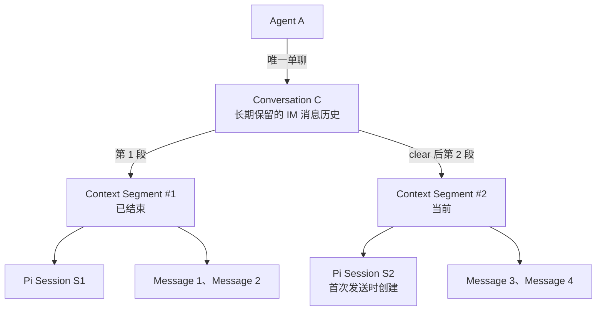
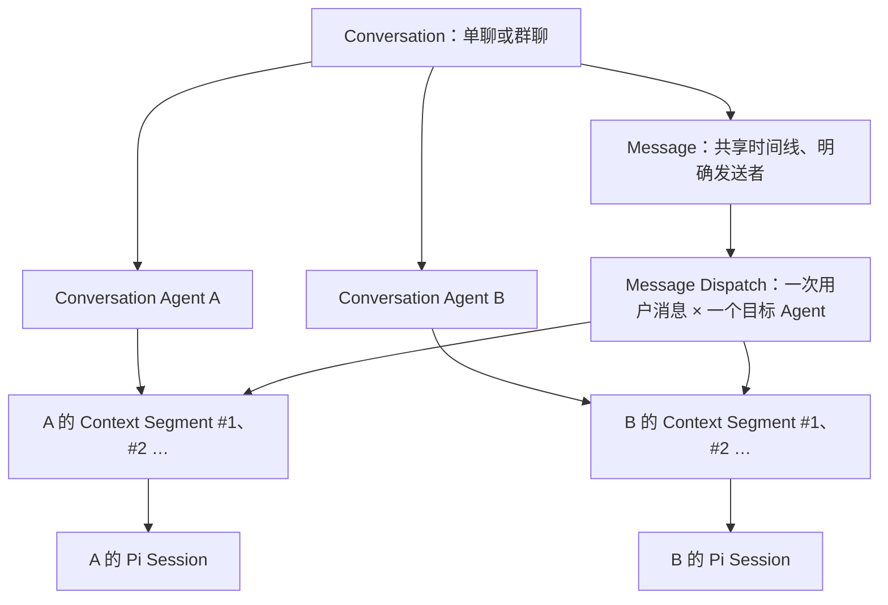

# 数据存储

> **Status**: `proposed`。以下是首发数据契约和 SQLite v1 目标模式；仓库目前没有这些表、文件或对应 Command。

AgentChat 只有一台 macOS Host 写入产品事实。文中的 `<HostData>`、`<HostCache>` 和 `<MobileData>` 分别由 Tauri 解析对应设备的应用数据或缓存目录，不是仓库路径；Pi Session 仍放在 Pi 自己的默认目录。桌面 Command 和移动端 HTTPS 接口调用同一组 Host Runtime 操作，不能各自维护产品数据副本。

## 存储位置与内容

```text
<HostData>/
  agentchat.sqlite                 安装、角色、长期聊天、上下文段、消息、设备登记
  agents/<agent-id>/MEMORY.md      单个 Agent 的长期记忆，按需创建
  host/cert.pem                    Host HTTPS 证书的公有部分
<HostCache>/
  pi-context/<process-id>.md       从角色配置和记忆生成；Pi 进程退出后删除
macOS 系统安全存储
  AgentChat Host TLS 私钥          与 host/cert.pem 对应

Pi 默认会话目录
  <Pi 创建的 Session 文件>         Pi 持有执行历史；Host 仅保存绝对路径引用

<MobileData>/
  cache.sqlite                    最近会话和消息的只读副本
iOS/Android 系统安全存储
  <host-id> -> device-id、设备凭据、Host 证书 SHA-256 指纹
```

| 内容 | 写入者 | 使用者 | 不存放在此处的内容 |
| --- | --- | --- | --- |
| Host SQLite | Host Runtime | 桌面经 Command、手机经已认证的 Host API | Pi 工具轨迹、token delta、模型密钥 |
| Agent `MEMORY.md` | Host Runtime，用户确认后写入 | 该 Agent 的 Pi 运行上下文、记忆编辑界面 | 其他 Agent 的记忆、会话全文 |
| Pi Session | Pi CLI | Conversation 当前上下文段的 Pi 进程 | AgentChat 产品消息的唯一副本 |
| 手机 `cache.sqlite` | 移动端 Rust 同步流程 | 手机离线只读界面 | 凭据、记忆、Pi Session、离线待发消息 |
| 系统安全存储 | Host 或移动端 Rust | TLS 与设备认证 | 普通消息和 Agent 指令 |

## Agent、聊天与 Pi Session 的关系



Agent 与单聊 Conversation 是一对一；Conversation 与 Context Segment 是一对多。每条 Message 同时保存 `conversation_id` 和 `context_id`，聊天内的 `sequence` 跨段递增。每个已使用的段最多关联一个 Pi Session；`clear` 新增段和分隔提示，旧消息仍在原聊天中。群聊的目标结构与迁移路径见下文[群聊扩展](#群聊扩展v2-目标设计)。

## Host SQLite v1

以下 SQL 定义首发最小字段、关系和索引。所有 ID 均为不透明 UUID 字符串，时间均为 UTC Unix 毫秒。Host 在打开数据库时启用外键，使用 `PRAGMA user_version` 管理模式迁移；现有产品数据不能通过删库升级。

```sql
PRAGMA foreign_keys = ON;

CREATE TABLE installation (
  singleton INTEGER PRIMARY KEY CHECK (singleton = 1),
  host_id TEXT NOT NULL UNIQUE,
  created_at_ms INTEGER NOT NULL
);

CREATE TABLE agents (
  id TEXT PRIMARY KEY,
  name TEXT NOT NULL CHECK (length(trim(name)) > 0),
  description TEXT NOT NULL DEFAULT '',
  instructions TEXT NOT NULL DEFAULT '',
  work_dir TEXT NOT NULL,
  model_provider TEXT,
  model_id TEXT,
  created_at_ms INTEGER NOT NULL,
  updated_at_ms INTEGER NOT NULL,
  deleted_at_ms INTEGER,
  CHECK ((model_provider IS NULL) = (model_id IS NULL))
);

CREATE TABLE conversations (
  id TEXT PRIMARY KEY,
  agent_id TEXT NOT NULL UNIQUE REFERENCES agents(id) ON DELETE RESTRICT,
  created_at_ms INTEGER NOT NULL,
  updated_at_ms INTEGER NOT NULL
);

CREATE INDEX conversations_recent
  ON conversations(updated_at_ms DESC);

CREATE TABLE conversation_contexts (
  id TEXT PRIMARY KEY,
  conversation_id TEXT NOT NULL
    REFERENCES conversations(id) ON DELETE RESTRICT,
  ordinal INTEGER NOT NULL CHECK (ordinal > 0),
  pi_session_file TEXT UNIQUE,
  started_at_ms INTEGER NOT NULL,
  closed_at_ms INTEGER,
  UNIQUE (conversation_id, ordinal)
);

CREATE UNIQUE INDEX conversation_current_context
  ON conversation_contexts(conversation_id)
  WHERE closed_at_ms IS NULL;

CREATE TABLE messages (
  id TEXT PRIMARY KEY,
  conversation_id TEXT NOT NULL
    REFERENCES conversations(id) ON DELETE RESTRICT,
  context_id TEXT NOT NULL
    REFERENCES conversation_contexts(id) ON DELETE RESTRICT,
  sequence INTEGER NOT NULL CHECK (sequence > 0),
  kind TEXT NOT NULL CHECK (kind IN ('user', 'assistant', 'error')),
  body_text TEXT,
  error_code TEXT,
  reply_to_message_id TEXT REFERENCES messages(id) ON DELETE RESTRICT,
  client_request_id TEXT,
  created_at_ms INTEGER NOT NULL,
  UNIQUE (conversation_id, sequence),
  CHECK (
    (kind = 'user' AND body_text IS NOT NULL
      AND error_code IS NULL AND reply_to_message_id IS NULL
      AND client_request_id IS NOT NULL)
    OR
    (kind = 'assistant' AND body_text IS NOT NULL
      AND error_code IS NULL AND reply_to_message_id IS NOT NULL
      AND client_request_id IS NULL)
    OR
    (kind = 'error' AND body_text IS NULL
      AND error_code IS NOT NULL AND reply_to_message_id IS NOT NULL
      AND client_request_id IS NULL)
  )
);

CREATE UNIQUE INDEX messages_user_request
  ON messages(conversation_id, client_request_id)
  WHERE kind = 'user';

CREATE UNIQUE INDEX messages_one_result
  ON messages(reply_to_message_id)
  WHERE reply_to_message_id IS NOT NULL;

CREATE TABLE devices (
  id TEXT PRIMARY KEY,
  name TEXT NOT NULL,
  credential_sha256 BLOB NOT NULL CHECK (length(credential_sha256) = 32),
  paired_at_ms INTEGER NOT NULL,
  last_seen_at_ms INTEGER,
  revoked_at_ms INTEGER
);
```

### 各表存什么、在哪里用

- `installation` 只有一行。`host_id` 是配对后手机识别 Host 和隔离缓存的稳定身份，不是用户账号或登录凭据。
- `agents` 保存角色展示信息、行为指令、默认工作目录和可选的 Pi 模型引用。`work_dir` 是 Host 校验后的绝对路径，只设定 Pi 的默认上下文，不是沙箱。`model_provider` 与 `model_id` 同时为空表示沿用 Pi 默认模型；供应商认证仍由 Pi 管理。记忆路径由 Agent ID 推导，不另存可由客户端改写的文件路径。
- `conversations` 的 `agent_id` 唯一：一个 Agent 只有一条长期 IM 聊天，列表以 Agent 名称展示，不另存可重复的聊天标题。聊天创建时同时创建 `ordinal = 1` 的初始上下文段；不提供为同一 Agent 新建第二条单聊的操作。群聊将来使用另一种形态，不复用这条约束。
- `conversation_contexts` 保存每次连续使用的 Pi 上下文。`ordinal` 从 1 递增，`closed_at_ms IS NULL` 的唯一一行是当前段；`pi_session_file` 在该段第一次执行前为空，取得 Pi 返回的绝对路径后、提交 prompt 前写入。此顺序依赖所装 Pi 版本在首轮 prompt 前提供可持久化 `sessionFile`，必须按[Pi Runtime 验收](02-pi-runtime.md#实现验收)用真实 CLI 确认。旧段和旧 Session 引用在 `clear` 后保留；一个 Session 文件只归属一个段。恢复文件失效时显式报错，不静默新建以免丢失当前上下文。
- `messages` 的 `sequence` 在整条 Conversation 中持续递增，跨 `clear` 也不重置；`context_id` 记录消息属于哪个上下文段。`user` 行保存原始用户文本与客户端生成的 `client_request_id`；`assistant` 行保存最终回复；`error` 行只保存稳定错误码，由客户端映射为可读说明。结果行与所回应的用户消息属于同一 Conversation 和同一段，Host 在写入时验证其归属和类型。唯一索引使一个用户消息最多对应一个最终结果。
- `devices` 的凭据由 Host 随机生成 32 字节，手机保存原值，Host 只保存 SHA-256 校验值；认证时按设备 ID 查找并使用恒定时间比较。`revoked_at_ms` 非空即拒绝该设备的新请求，并关闭其已有 SSE 连接。一次性二维码令牌仅在 Host 内存中保留至使用或过期。

只有 Agent 的 `deleted_at_ms` 表示“从列表移除”，其唯一聊天随之隐藏；Conversation、全部上下文段、Message、记忆文件和历次 Pi Session 引用继续保留。`clear` 不执行软删除，也不清除 IM 消息历史。设备撤销是另一操作，不能只隐藏设备而继续接受凭据。首发不提供物理删除或自动清理 Pi 文件；界面须说明本机数据仍在。

### 消息写入顺序

1. 客户端为一次发送生成 UUID `client_request_id`，并提交界面读到的 `expected_context_id`。Host 先按请求 ID 查重：已接受的请求直接返回原消息及结果；新请求只有在预期段仍为当前段时才入库，否则返回上下文已变化，由用户确认后重新发送。事务内分配全聊天 `sequence`、插入带 `context_id` 的 `user` Message，并更新 Conversation 的 `updated_at_ms`。
2. Host 将新消息放入该 Conversation 的内存顺序队列。若当前段尚无 Pi Session，Pi 创建 Session，Host 将其路径写入该段的 `pi_session_file`，再发送 prompt。
3. Pi 到达 `agent_settled` 且 Adapter 确认最终结果后，Host 在事务内写入一条 `assistant` 或 `error` Message。执行中仅发送实时 delta，不写入 SQLite。用户取消尚在 Host 队列中的消息时写入 `error_code = 'cancelled'`，并从队列移除；活动执行取消后按 Adapter 确认的结果写入取消或中断错误。已接受但尚无结果的用户消息若在 Host 重启后仍无结果，界面显示“可能未完成”；只有用户发起新请求才再次执行。

### `clear` 上下文

`clear` 是 Conversation 的产品操作，不是普通用户消息，也不删除旧消息。请求携带 `expected_context_id`；若当前段已变化，Host 返回最新段而不再次清理。Host 只在该聊天没有运行中或排队消息时接受；否则返回忙碌错误，界面提示等待队列空闲或先取消相关执行。空的当前段（还没有消息和 Pi Session）再次 `clear` 是无变化的成功操作。

有效 `clear` 在一个 SQLite 事务中关闭当前段、插入 `ordinal + 1` 的新段，并更新 Conversation 的 `updated_at_ms`。旧 Pi 进程被停止回收，Session 文件留在 Pi 默认目录；新段的 `pi_session_file` 先为空，下次发送时启动全新 Pi Session。聊天消息继续按原 `sequence` 展示，界面按段的 `ordinal` 在新段第一条消息前插入“上下文已清理”分隔提示；新段尚无消息时提示位于历史末尾。旧段内容不会重新送入 Pi；Agent 的角色指令和长期记忆仍在新段生效。Pi RPC 官方提供 `new_session`，但本设计以停止旧进程、下一次发送时新建进程来避免运行态切换与数据库提交之间出现双重当前 Session。[Pi RPC 命令文档](https://pi.dev/docs/latest/rpc-commands)。

## Agent 记忆文件

`agents/<agent-id>/MEMORY.md` 是该 Agent 跨 Conversation 记忆的唯一事实来源。文件为 UTF-8 Markdown，不使用 Frontmatter；Agent 名称、模型和工作目录只在 SQLite 中保存。新 Agent 可以没有文件，读取时等同空记忆；首次确认保存时才创建。默认编辑内容如下，标题用于帮助用户整理，Host 不解析标题或自动提炼条目：

```markdown
# 长期记忆

## 用户偏好

## 领域事实

## 工作约定
```

用户在记忆界面编辑全文，或从 Agent 回复中选择建议内容、编辑后确认。Host 读文件时返回内容和其 SHA-256 版本值；写入请求携带旧版本，版本不符则返回冲突和最新内容。Host 只接受目标 Agent ID，生成目标路径，将新内容写入同目录临时文件后原子替换；不允许客户端传入任意文件路径。空文件与不存在的文件视为同一版本。首发不保存待批准提案表，也不每轮自动提炼记忆。

启动 Pi 时，Host 从 `agents.instructions` 与该 Agent 的 `MEMORY.md` 生成一次性的上下文文件，使用 Pi `--append-system-prompt` 加载；文件只存在于对应进程运行期间，源数据仍是 SQLite 和 Markdown。[Pi CLI 文档](https://pi.dev/docs/latest/cli)。记忆或角色指令更新后，相关空闲 Pi 进程在下一轮前重启；进行中的轮次先完成，再重启并使用当前上下文段保存的 `pi_session_file` 恢复。新内容从下一轮生效。[Pi Session 文档](https://pi.dev/docs/latest/sessions)。

Host 只主动向对应 Pi 进程提供该 Agent 的记忆。Pi 工具仍继承 macOS 用户权限，工作目录和记忆目录不构成 OS 隔离。

## 手机只读缓存 v1

手机使用独立 SQLite，打开时同样启用外键，只保存当前已配对 Host 的可展示投影。缓存模式不含发送队列、认证材料或 Agent 记忆：

```sql
CREATE TABLE cached_host (
  host_id TEXT PRIMARY KEY,
  last_synced_at_ms INTEGER NOT NULL
);

CREATE TABLE cached_agents (
  host_id TEXT NOT NULL REFERENCES cached_host(host_id)
    ON DELETE CASCADE,
  agent_id TEXT NOT NULL,
  name TEXT NOT NULL,
  description TEXT NOT NULL,
  PRIMARY KEY (host_id, agent_id)
);

CREATE TABLE cached_conversations (
  host_id TEXT NOT NULL,
  conversation_id TEXT NOT NULL,
  agent_id TEXT NOT NULL,
  updated_at_ms INTEGER NOT NULL,
  PRIMARY KEY (host_id, conversation_id),
  FOREIGN KEY (host_id, agent_id)
    REFERENCES cached_agents(host_id, agent_id) ON DELETE CASCADE
);

CREATE TABLE cached_contexts (
  host_id TEXT NOT NULL,
  context_id TEXT NOT NULL,
  conversation_id TEXT NOT NULL,
  ordinal INTEGER NOT NULL,
  started_at_ms INTEGER NOT NULL,
  closed_at_ms INTEGER,
  PRIMARY KEY (host_id, context_id),
  FOREIGN KEY (host_id, conversation_id)
    REFERENCES cached_conversations(host_id, conversation_id)
    ON DELETE CASCADE
);

CREATE TABLE cached_messages (
  host_id TEXT NOT NULL,
  message_id TEXT NOT NULL,
  conversation_id TEXT NOT NULL,
  context_id TEXT NOT NULL,
  sequence INTEGER NOT NULL,
  kind TEXT NOT NULL CHECK (kind IN ('user', 'assistant', 'error')),
  body_text TEXT,
  error_code TEXT,
  reply_to_message_id TEXT,
  created_at_ms INTEGER NOT NULL,
  PRIMARY KEY (host_id, message_id),
  FOREIGN KEY (host_id, conversation_id)
    REFERENCES cached_conversations(host_id, conversation_id)
    ON DELETE CASCADE,
  FOREIGN KEY (host_id, context_id)
    REFERENCES cached_contexts(host_id, context_id)
    ON DELETE CASCADE
);

CREATE INDEX cached_conversations_recent
  ON cached_conversations(host_id, updated_at_ms DESC);

CREATE INDEX cached_messages_by_conversation
  ON cached_messages(host_id, conversation_id, sequence);
```

连接成功或重连时，手机按 Host 的当前可见列表重新获取最近 20 个 Conversation、每个 Conversation 最新 100 条 Message，以及这些消息引用和当前活动的 Context Segment，在一个本地事务中替换该 Host 的缓存并更新 `last_synced_at_ms`。`cached_contexts` 不含 Pi Session 路径，只供界面呈现 `clear` 分隔；聊天列表使用 `cached_agents.name`，不另存聊天标题。SSE 只更新在线界面；断线后重新取快照，不补放 delta。移除的 Agent 及聊天在下一次成功同步时从缓存消失；离线时可能仍显示旧快照，界面明确标出离线状态与最后同步时间。发送、取消和 `clear` 都需要 Host 在线。

## 凭据、偏好与非持久状态

Host 的 HTTPS 公钥证书位于 `<HostData>/host/cert.pem`，对应私钥以 Host ID 为索引保存在 macOS 系统安全存储。二维码提供 Host ID、局域网地址、证书 SHA-256 指纹和短时一次性配对令牌。手机配对成功后，将 `host_id`、`device_id`、设备凭据和证书指纹作为同一 Host 的安全存储项；证书变化或 Host 私钥丢失后必须重新配对，不能忽略校验错误。`devices` 表不存原始设备凭据、TLS 私钥或配对令牌。

窗口状态由本设备的 Tauri 窗口状态机制维护；其他未实现的 UI 偏好首发不新增 Host 表。草稿、执行队列、Run 状态、SSE 连接和 token delta 只驻留内存。Host 不持久化独立 Task、附件、Pi 工具轨迹或主分身观察记录，也不提供应用层静态加密、备份和导出。普通 SQLite 与 Markdown 数据按本机应用数据保存；当前仓库 Stronghold 的 `DefaultHasher` 派生方式不能用于生产密钥。

## 实现验收

- 同一 Agent 只有一条 Conversation；使用同一请求 ID 重试只得到一条 `user` Message；正常回复和失败各写一条同段关联结果，Host 中断后无结果消息不会自动重跑。
- Agent 记忆的并发编辑能检测版本冲突；更新后只影响该 Agent 下一轮上下文。使用真实 Pi RPC 验证 `--append-system-prompt` 与 `--session` 恢复组合。
- 空闲聊天执行 `clear` 后，聊天 ID 与旧消息不变，新消息进入新 Context Segment 和新 Pi Session；运行中或有队列时拒绝 `clear`。新段还没有消息时重复 `clear` 不新增空段。
- 移除 Agent 后，其他手机下次同步移除对应缓存，但 Host 的聊天、消息、记忆和历次 Pi Session 引用仍可核查。
- 撤销设备后旧凭据不能请求或订阅；证书不匹配时手机拒绝连接；离线缓存严格限制为 20 个会话、每会话 100 条消息。
- SQLite v1 迁移和以后版本升级保留既有产品记录；前端、移动端网络服务和 Pi Adapter 均不能直接写 Host SQLite。

## 群聊扩展（v2 目标设计）

本节定义后续引入群聊时的产品数据契约，**不属于首发 SQLite v1，也不表示群聊已经实现**。群聊是一个由用户和多个 Agent 参与、共享一条可见消息时间线的 Conversation；仍只有一位本机用户，不引入多人账号、Agent 自动互相发言或后台任务编排。单聊 ID、消息 ID 与序号在升级后保持不变。



### v2 表与字段

以下是替换 v1 `conversations`、`conversation_contexts`、`messages` 并新增关联表后的**目标模式**。`installation`、`agents`、`devices` 继续沿用 v1。这里给出完整目标表定义；实际升级通过事务重建表和回填数据，不直接对已有表执行这段 `CREATE TABLE`。

```sql
CREATE TABLE conversations (
  id TEXT PRIMARY KEY,
  kind TEXT NOT NULL CHECK (kind IN ('direct', 'group')),
  title TEXT,
  context_generation INTEGER NOT NULL DEFAULT 1 CHECK (context_generation > 0),
  context_start_after_sequence INTEGER NOT NULL DEFAULT 0
    CHECK (context_start_after_sequence >= 0),
  created_at_ms INTEGER NOT NULL,
  updated_at_ms INTEGER NOT NULL,
  UNIQUE (id, kind),
  CHECK (
    (kind = 'direct' AND title IS NULL)
    OR (kind = 'group' AND title IS NOT NULL AND length(trim(title)) > 0)
  )
);

CREATE INDEX conversations_recent
  ON conversations(updated_at_ms DESC);

CREATE TABLE conversation_clears (
  conversation_id TEXT NOT NULL REFERENCES conversations(id) ON DELETE RESTRICT,
  generation INTEGER NOT NULL CHECK (generation > 1),
  after_sequence INTEGER NOT NULL CHECK (after_sequence >= 0),
  cleared_at_ms INTEGER NOT NULL,
  PRIMARY KEY (conversation_id, generation)
);

CREATE TABLE conversation_agents (
  conversation_id TEXT NOT NULL REFERENCES conversations(id) ON DELETE RESTRICT,
  agent_id TEXT NOT NULL REFERENCES agents(id) ON DELETE RESTRICT,
  kind TEXT NOT NULL CHECK (kind IN ('direct', 'group')),
  joined_at_ms INTEGER NOT NULL,
  left_at_ms INTEGER,
  PRIMARY KEY (conversation_id, agent_id),
  UNIQUE (conversation_id, agent_id, kind),
  CHECK (left_at_ms IS NULL OR left_at_ms >= joined_at_ms),
  CHECK (kind = 'group' OR left_at_ms IS NULL),
  FOREIGN KEY (conversation_id, kind)
    REFERENCES conversations(id, kind)
);

CREATE UNIQUE INDEX one_direct_per_agent
  ON conversation_agents(agent_id)
  WHERE kind = 'direct';

CREATE TABLE agent_contexts (
  id TEXT PRIMARY KEY,
  conversation_id TEXT NOT NULL,
  agent_id TEXT NOT NULL,
  ordinal INTEGER NOT NULL CHECK (ordinal > 0),
  conversation_generation INTEGER NOT NULL CHECK (conversation_generation > 0),
  pi_session_file TEXT UNIQUE,
  start_after_sequence INTEGER NOT NULL DEFAULT 0 CHECK (start_after_sequence >= 0),
  consumed_through_sequence INTEGER NOT NULL DEFAULT 0 CHECK (consumed_through_sequence >= 0),
  started_at_ms INTEGER NOT NULL,
  closed_at_ms INTEGER,
  CHECK (consumed_through_sequence >= start_after_sequence),
  FOREIGN KEY (conversation_id, agent_id)
    REFERENCES conversation_agents(conversation_id, agent_id)
    ON DELETE RESTRICT,
  UNIQUE (conversation_id, agent_id, ordinal),
  UNIQUE (id, conversation_id, agent_id)
);

CREATE UNIQUE INDEX agent_current_context
  ON agent_contexts(conversation_id, agent_id)
  WHERE closed_at_ms IS NULL;

CREATE TABLE messages (
  id TEXT PRIMARY KEY,
  conversation_id TEXT NOT NULL
    REFERENCES conversations(id) ON DELETE RESTRICT,
  sequence INTEGER NOT NULL CHECK (sequence > 0),
  conversation_generation INTEGER NOT NULL CHECK (conversation_generation > 0),
  kind TEXT NOT NULL CHECK (kind IN ('user', 'assistant', 'error')),
  sender_agent_id TEXT REFERENCES agents(id) ON DELETE RESTRICT,
  context_id TEXT REFERENCES agent_contexts(id) ON DELETE RESTRICT,
  body_text TEXT,
  error_code TEXT,
  reply_to_message_id TEXT REFERENCES messages(id) ON DELETE RESTRICT,
  client_request_id TEXT,
  created_at_ms INTEGER NOT NULL,
  UNIQUE (conversation_id, sequence),
  CHECK (
    (kind = 'user' AND sender_agent_id IS NULL AND context_id IS NULL
      AND body_text IS NOT NULL AND error_code IS NULL
      AND reply_to_message_id IS NULL AND client_request_id IS NOT NULL)
    OR
    (kind = 'assistant' AND sender_agent_id IS NOT NULL AND context_id IS NOT NULL
      AND body_text IS NOT NULL AND error_code IS NULL
      AND reply_to_message_id IS NOT NULL AND client_request_id IS NULL)
    OR
    (kind = 'error' AND sender_agent_id IS NOT NULL AND context_id IS NOT NULL
      AND body_text IS NULL AND error_code IS NOT NULL
      AND reply_to_message_id IS NOT NULL AND client_request_id IS NULL)
  )
);

CREATE UNIQUE INDEX messages_user_request
  ON messages(conversation_id, client_request_id)
  WHERE kind = 'user';

CREATE UNIQUE INDEX messages_one_result_per_agent
  ON messages(reply_to_message_id, sender_agent_id)
  WHERE reply_to_message_id IS NOT NULL;

CREATE TABLE message_dispatches (
  user_message_id TEXT NOT NULL REFERENCES messages(id) ON DELETE RESTRICT,
  agent_id TEXT NOT NULL REFERENCES agents(id) ON DELETE RESTRICT,
  context_id TEXT NOT NULL REFERENCES agent_contexts(id) ON DELETE RESTRICT,
  conversation_generation INTEGER NOT NULL CHECK (conversation_generation > 0),
  input_after_sequence INTEGER CHECK (input_after_sequence >= 0),
  input_through_sequence INTEGER NOT NULL CHECK (input_through_sequence > 0),
  created_at_ms INTEGER NOT NULL,
  PRIMARY KEY (user_message_id, agent_id),
  CHECK (input_after_sequence IS NULL
    OR input_through_sequence > input_after_sequence)
);
```

单聊必须且只能有一名 Agent；群聊创建时至少有两名 Agent，这两项跨行条件由 Host 在创建事务中校验。Conversation 的 `kind` 创建后不改变。`conversation_agents.kind` 是为数据库强制保证单聊唯一性而保留的类型副本，由复合外键确保与 Conversation 一致；群成员退出后保留关联及历史，退出的 Agent 不会接收新消息。重新加入可重新激活同一关联，保留其历史 Context Segment，并新建一个上下文段；`joined_at_ms` 记录最近一次加入时间，`left_at_ms` 清空。若需要完整成员进出审计，再增加独立事件表。

用户消息在共享时间线上只有一行，`sender_agent_id` 与 `context_id` 均为空。Host 为实际选中的每个 Agent 写一行 `message_dispatches`，固定该轮使用的上下文段；同一条用户消息可有多个 Dispatch，也可一个都没有。Agent 回复和错误各在共享时间线上占一行，携带发送者、执行段和所回应的用户消息；每个 Dispatch 最多有一条最终结果。Host 在事务中验证 Dispatch、回复、Context Segment 与 Conversation 的归属一致，并检查回复者在派发时是活跃成员。用户取消尚未提交给 Pi 的 Dispatch 时为该 Agent 写入取消错误并从 Host 队列移除。队列和运行状态仍只在内存中；重启后 Dispatch 没有结果表示该 Agent 的执行结果未知，不自动重放。

**路由默认值：** 群消息对用户和所有群成员可见。发送请求把界面上的 `@Agent` 作为明确的 Agent ID 列表提交，`@all` 作为独立目标标记提交；Host 校验目标属于该群，并在消息入库事务中把 `@all` 展开为当时所有活跃 Agent。重复提及同一 Agent 只建立一次 Dispatch。没有 `@` 的普通消息只写入共享时间线，不启动 Pi。Host 以 Dispatch 行保存最终目标集合，重试或成员变化后不重新解析文本。直接单聊的普通消息始终指向唯一的 Agent。群成员退出或 Agent 被软删除后，不再接受针对它的新 Dispatch，已有结果和 Session 引用保留。

**共享消息如何进入各自的 Pi Session：** 每个 Agent 都需要在被唤起时看到它尚未读过的群内用户消息及其他 Agent 的最终回复，包括没有 `@` 的消息；这不表示每条消息都立即启动所有 Agent。Host 在该 Agent 实际执行下一轮时，按 `sequence` 将 `(consumed_through_sequence, 当前触发消息的 sequence]` 范围内的 `user` 和 `assistant` 消息组装为带发送者标识的输入，跳过该 Agent 在当前段已写入自身 Pi Session 的回复；`error` 只留在产品时间线。此范围内其他 Agent 的回复只有在触发消息之前已经入库才会被包含；之后到达的回复留待下一轮。Session 保留已送达的内容，Host 不在每轮重发全部历史。群聊首次唤起某 Agent 时，其输入从当前 `context_start_after_sequence` 开始，因此它会收到本轮群上下文开始以来的全部可见消息；首次唤起前不存在自己的 Pi Session。若这段完整输入超出所选模型的上下文容量，Host 明确报错并请用户先清理群上下文，不静默截断或生成未经确认的摘要。

`message_dispatches.input_through_sequence` 在发送事务中固定为触发消息的序号；排队时 `input_after_sequence` 为空，实际执行时从该 Agent 当前段的 `consumed_through_sequence` 取值并固定。Host 在 Pi 确认接受 prompt 后更新游标；尚未确认前不得把共享消息视为已读。Pi 接受与 SQLite 提交无法原子化，进程在两者之间崩溃时必须标记该 Agent 的上下文为待核查，不能自动续送或跳过这些消息；用户可核查 Pi Session 后继续，或执行整个 Conversation 的 `clear` 开新段。输入正文仍由 Host 从不可变的产品消息按边界重建，避免再保存一份完整群聊文本。每个 Agent 的长期记忆继续只取自己的 `MEMORY.md`，共享消息不写入任何 Agent 的记忆文件。

**顺序与清理：** `sequence` 仍是整个 Conversation 的唯一展示顺序。Host 按全聊天入库顺序派发，针对同一 Agent 的 Dispatch 串行执行；不同 Agent 可在 Host 的全局并发上限内运行。`clear` 始终作用于整个 Conversation：群聊中所有活跃 Agent 的当前段一起结束，全部开启新段；单聊则只有一个段。只要该 Conversation 中任一 Agent 正在执行或仍有排队 Dispatch，就整体拒绝 `clear`，用户须等待队列空闲或先取消。若本代次还没有新消息和 Pi Session，重复 `clear` 是无变化的成功操作。有效清理在同一事务中插入 `conversation_clears`、增加 `context_generation`、记录清理时的最新 `sequence`，并切换所有活跃 Agent 的段；随后回收旧 Pi 进程。新段的 `start_after_sequence` 和 `consumed_through_sequence` 都设为该序号，之后每个 Agent 只补读群聊重启后发生的消息。新加入或重新加入的 Agent 也从 Conversation 当前的 `context_start_after_sequence` 开始。旧消息仍可在界面查看，界面用一条群级“上下文已清理”分隔提示表示边界；旧内容不会注入任何新 Session。聊天 ID、全部消息、Dispatch 与旧 Pi Session 文件保留。入队、取消完成和 `clear` 必须经同一 Conversation 串行门控；提交 Dispatch 时固定 `context_id` 和 `context_generation`，此后不得改派到新段。清理请求携带预期 `context_generation`，重复请求不会再清理一次。

### 从 v1 升级

1. 在数据库事务中重建目标表。每条旧 Conversation 变为 `kind = 'direct'`、`title = NULL`，原 `agent_id` 回填到 `conversation_agents`；原 Conversation ID 和消息 `sequence` 不变。
2. 原 `conversation_contexts` 原样保留 ID、序号、Pi Session 路径与起止时间，补上该 Conversation 的 `agent_id`，成为 `agent_contexts`。从旧段的先后关系回填 `conversation_generation`、`conversation_clears` 与当前群级边界。每段的 `start_after_sequence` 取前一段最后一条消息的 `sequence`（首段为 0）；`consumed_through_sequence` 置为该段已保存的最大消息序号，避免升级后把旧单聊消息重新注入 Pi。v1 没有持久化 prompt 接受位置，旧 Dispatch 的 `input_after_sequence` 留空，不伪造精确输入范围。原 `user` 消息的 `context_id` 转成对应 `message_dispatches` 的固定段；其 `input_through_sequence` 为该用户消息序号。所有消息和 Dispatch 的 `conversation_generation` 取原消息所在段的代次。`assistant`/`error` 消息保留 `context_id`，并补上 `sender_agent_id`。旧用户消息的 `context_id` 在新 `messages` 中置空。
3. 对每条已接受的旧用户消息写一条 Dispatch，即使其结果缺失也保留。未完成的旧消息仍显示结果未知，不在迁移时执行。校验单聊成员、每个上下文段、Dispatch 与消息引用可达，以及每个 Agent 至多一个当前段；成功后再提升 `user_version`。
4. 手机缓存是 Host 投影：升级其本地模式以保存 Conversation 类型和标题、群成员摘要、消息发送者以及各 Agent 的段摘要。同步仍按最近 20 个 Conversation、每个最新 100 条消息取快照；缓存不含 Dispatch 队列或 Pi Session 路径。旧缓存可清空后从 Host 重建，Host 产品数据库不能删库重建。

### v2 手机缓存投影

`cached_host` 与 `cached_agents` 沿用 v1。以下为重建后的其余目标表；群里已退出的 Agent 仍须保留摘要，以正确显示历史消息作者。缓存仅为界面投影，不推导 Host 的路由或 Pi 上下文。

```sql
CREATE TABLE cached_conversations (
  host_id TEXT NOT NULL REFERENCES cached_host(host_id) ON DELETE CASCADE,
  conversation_id TEXT NOT NULL,
  kind TEXT NOT NULL CHECK (kind IN ('direct', 'group')),
  title TEXT,
  context_generation INTEGER NOT NULL,
  updated_at_ms INTEGER NOT NULL,
  PRIMARY KEY (host_id, conversation_id)
);

CREATE TABLE cached_conversation_agents (
  host_id TEXT NOT NULL,
  conversation_id TEXT NOT NULL,
  agent_id TEXT NOT NULL,
  left_at_ms INTEGER,
  PRIMARY KEY (host_id, conversation_id, agent_id),
  FOREIGN KEY (host_id, conversation_id)
    REFERENCES cached_conversations(host_id, conversation_id) ON DELETE CASCADE,
  FOREIGN KEY (host_id, agent_id)
    REFERENCES cached_agents(host_id, agent_id) ON DELETE CASCADE
);

CREATE TABLE cached_clears (
  host_id TEXT NOT NULL,
  conversation_id TEXT NOT NULL,
  generation INTEGER NOT NULL,
  after_sequence INTEGER NOT NULL,
  cleared_at_ms INTEGER NOT NULL,
  PRIMARY KEY (host_id, conversation_id, generation),
  FOREIGN KEY (host_id, conversation_id)
    REFERENCES cached_conversations(host_id, conversation_id) ON DELETE CASCADE
);

CREATE TABLE cached_contexts (
  host_id TEXT NOT NULL,
  context_id TEXT NOT NULL,
  conversation_id TEXT NOT NULL,
  agent_id TEXT NOT NULL,
  ordinal INTEGER NOT NULL,
  conversation_generation INTEGER NOT NULL,
  start_after_sequence INTEGER NOT NULL,
  closed_at_ms INTEGER,
  PRIMARY KEY (host_id, context_id),
  FOREIGN KEY (host_id, conversation_id, agent_id)
    REFERENCES cached_conversation_agents(host_id, conversation_id, agent_id)
    ON DELETE CASCADE
);

CREATE TABLE cached_messages (
  host_id TEXT NOT NULL,
  message_id TEXT NOT NULL,
  conversation_id TEXT NOT NULL,
  sequence INTEGER NOT NULL,
  conversation_generation INTEGER NOT NULL,
  kind TEXT NOT NULL CHECK (kind IN ('user', 'assistant', 'error')),
  sender_agent_id TEXT,
  context_id TEXT,
  body_text TEXT,
  error_code TEXT,
  reply_to_message_id TEXT,
  created_at_ms INTEGER NOT NULL,
  PRIMARY KEY (host_id, message_id),
  FOREIGN KEY (host_id, conversation_id)
    REFERENCES cached_conversations(host_id, conversation_id) ON DELETE CASCADE,
  FOREIGN KEY (host_id, sender_agent_id)
    REFERENCES cached_agents(host_id, agent_id),
  FOREIGN KEY (host_id, context_id)
    REFERENCES cached_contexts(host_id, context_id)
);

CREATE INDEX cached_conversations_recent
  ON cached_conversations(host_id, updated_at_ms DESC);

CREATE INDEX cached_messages_by_conversation
  ON cached_messages(host_id, conversation_id, sequence);
```

Host 快照包含最近 20 个 Conversation 的现存及历史成员摘要、最新 100 条消息，以及展示这些消息和当前群级分隔所需的 Context/Clear 摘要。若最后 100 条消息的回复指向已淘汰的用户消息，`reply_to_message_id` 仅作远端 ID 展示线索，不要求本地外键存在。群聊 `clear` 在没有新消息时也须同步 `context_generation` 和最新 `cached_clears`，以便离线界面呈现当前已清理状态。

### 群聊验收条件

- `@Agent` 只产生该 Agent 的 Dispatch；`@all` 对发送时所有活跃 Agent 各产生一个 Dispatch；无 `@` 消息不执行，但在相关 Agent 下次执行时进入其共享输入。
- 两个 Agent 各自的 Pi Session 保留各自已读历史；其中一个 Agent 的回复在另一个 Agent 下一次被唤起时进入其输入，且不会被重复注入。单聊仍维持一个 Agent、一条长期 Conversation。
- 群里任一 Agent 运行或排队时整体拒绝 `clear`；空闲后一次清理切换所有活跃 Agent 的段与群级代次，新 Session 不读旧代消息，界面仍能看到完整消息历史。
- v1 → v2 迁移保留所有单聊消息、段、Pi Session 引用与请求 ID；重建移动缓存不影响 Host 记录。
